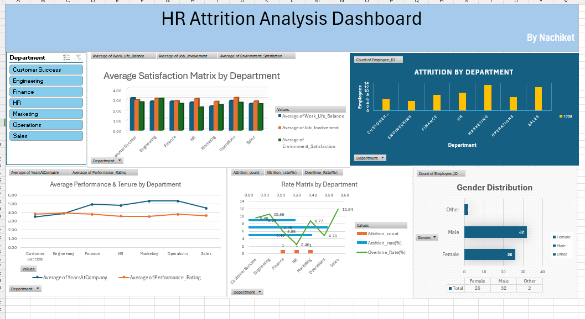

# 📊 HR Attrition Analysis Dashboard (Excel)

An interactive HR Attrition Analysis Dashboard built entirely in Microsoft Excel using Power Query, Power Pivot, DAX, Pivot Tables, and Pivot Charts. This project demonstrates the complete data analytics workflow—from data cleaning to dashboard creation.

---

## 📌 Project Overview

Employee attrition is one of the key HR metrics that helps organizations understand employee turnover and identify departments with higher attrition rates.

In this project, I transformed raw HR data into an interactive dashboard that provides meaningful insights into employee attrition, satisfaction, performance, and workforce trends.

---

## 🛠 Tools & Technologies

- Microsoft Excel
- Power Query (ETL)
- Power Pivot
- Data Modeling
- DAX (Data Analysis Expressions)
- Pivot Tables
- Pivot Charts
- Slicers
- Dashboard Design

---

## 🔄 ETL Process (Power Query)

The dataset was cleaned and transformed using Power Query by:

- Importing raw HR data
- Cleaning inconsistent data
- Changing data types
- Removing unnecessary columns
- Preparing dimension and fact tables
- Loading transformed tables into the Excel Data Model

---

## 🗂 Data Modeling

A relational data model was created using Power Pivot.

Tables were connected using relationships to build a Star Schema, improving analysis and reducing data redundancy.

Example Tables:

- Fact_Attrition
- Dim_Employee
- Dim_Department
- Dim_Satisfaction
- Dim_Performance

---

## 📈 DAX Measures

Several DAX measures were created to calculate important business metrics, including:

- Employee Count
- Attrition Count
- Attrition Rate
- Average Satisfaction
- Average Years at Company
- Average Performance Rating
- Overtime Rate

---

## 📊 Dashboard Features

The dashboard includes:

- Department-wise Attrition Analysis
- Average Satisfaction by Department
- Performance & Tenure Analysis
- Attrition Rate vs Overtime Rate
- Gender Distribution
- Interactive Department Slicer

---

## 📷 Dashboard Preview

Example:

---

## 📌 Key Insights

- Marketing and Sales departments show higher attrition.
- Employee satisfaction varies across departments.
- Departments with higher overtime tend to experience higher attrition.
- Average employee tenure differs significantly among departments.
- Gender distribution provides an overview of workforce composition.

---

## 📂 Dataset

**Dataset:** HR Employee Attrition Dataset

The dataset contains employee information such as:

- Department
- Job Role
- Gender
- Age
- Attrition Status
- Overtime
- Satisfaction Scores
- Performance Rating
- Years at Company

This dataset is commonly used for learning and portfolio projects in HR Analytics.

---

## 🎯 Skills Demonstrated

- Data Cleaning
- ETL Process
- Data Modeling
- Power Query
- Power Pivot
- DAX
- Pivot Tables
- Dashboard Development
- Data Visualization
- Business Intelligence
- HR Analytics

---

## 🚀 Future Improvements

- Add KPI Cards
- Build advanced DAX measures
- Include dynamic trend analysis
- Create drill-down reports
- Rebuild the dashboard in Power BI

---

## ⭐ If you found this project useful, consider giving it a Star!